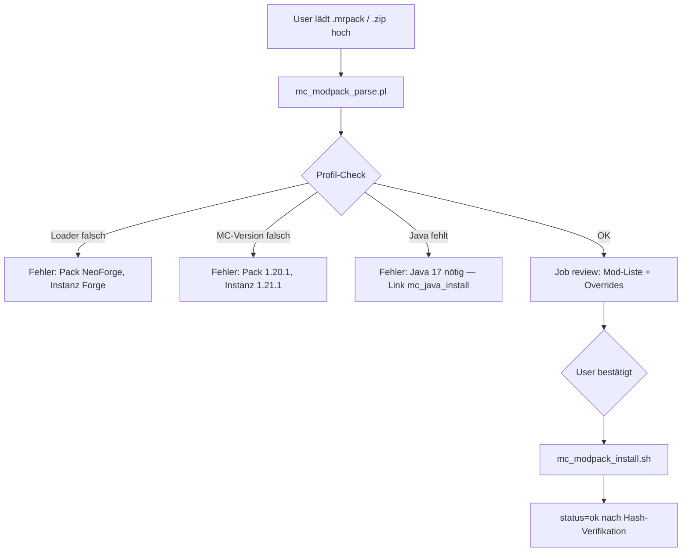

# Minecraft-Profil, Java pro Instanz & Mod-Management — Design Spec

**Datum:** 2026-06-28  
**Status:** Phase 1 implementiert; Phase 2–4 offen

---

## Ziel

Minecraft-Instanzen sollen im Wizard mit **Loader + MC-Version** angelegt werden, mit **Java pro Instanz** (mehrere Server mit unterschiedlichen Java-Majors auf einem Host). Mods/Plugins werden **später in manage.cgi** installiert — gefiltert nach Loader, Version und Server-Tauglichkeit.

Profil-Wechsel (Version oder Loader) muss **jederzeit** möglich sein (Modpack-Entwicklung). Vorhandene Mod-Dateien werden **nicht automatisch gelöscht**; stattdessen liefert ein Kompatibilitäts-Report Probleme und Lösungsvorschläge (z. B. Mod auf Version Y wechseln).

**LGSM-first:** Start/Stop/Monitor/Port/Config bleiben bei LGSM. Eigene Worker nur für Loader-Setup (Fabric/Forge/NeoForge), Java-Bereitstellung, Mod-Download und Profil-Migration.

---

## Architektur-Übersicht

```
Wizard (MC-Profil) ──► Registry + .mcprofile.json
                              │
         ┌────────────────────┼────────────────────┐
         ▼                    ▼                    ▼
   mc_java_install      mc_loader_install    LGSM update
   ($SERVER_DIR/.java)  (Fabric/Forge/…)     (Vanilla/Paper)
         │                    │                    │
         └────────────────────┴────────────────────┘
                              │
                    LGSM instance.cfg
                    (executable, javaram, serverversion)
                              │
                    manage.cgi Mod-Browser
                    (Modrinth / CurseForge / Hangar)
                              │
                    mc_profile_change (Migration)
                    (Scan → Report → Apply)
```

---

## Entscheidungen (fix)

| Thema | Entscheidung |
|-------|--------------|
| Wizard | **C:** Loader + Version im Wizard; Mods erst in manage |
| Profil-Wechsel | **B:** Loader-Wechsel in v1 erlaubt, mit vollem Kompatibilitäts-Report |
| Server-Lifecycle | **LGSM-first** — nur Start-Datei / Java / Cfg anpassen |
| Loader-Install | **Eigene Worker** für Fabric, Forge, NeoForge + Mod-Download |
| Vanilla/Paper Version | **LGSM-native** — `serverversion` in Instanz-Cfg + `./<script> update` |
| Java | **B:** Temurin (Eclipse Adoptium) pro Instanz unter `$SERVER_DIR/.java/` |
| Mods bei Migration | **Nie auto-löschen** — Report + optionale Mod-Updates |

---

## Instanz-Profil (Single Source of Truth)

Datei: `$SERVER_DIR/.mcprofile.json` (Game-User-Ownership, chmod 0644)

Zusätzlich Registry-Spalten oder TSV-Erweiterung für schnelle Listenansicht (optional, Cache aus JSON).

```json
{
  "loader": "paper",
  "mc_version": "1.21.1",
  "java_major": 21,
  "java_home": ".java/temurin-21",
  "lgsm_script": "mc-paper",
  "mod_dir": "plugins",
  "paper_build": "latest"
}
```

| Feld | Werte | Bedeutung |
|------|-------|-----------|
| `loader` | `vanilla`, `paper`, `fabric`, `forge`, `neoforge` | Install-Pfad, Mod-API-Filter |
| `mc_version` | semver, z. B. `1.21.1` | LGSM `serverversion`, Mod-Filter |
| `java_major` | `8`, `11`, `17`, `21`, … | Aus Kompatibilitäts-Matrix |
| `java_home` | relativ zu `$SERVER_DIR` | Wrapper setzt `JAVA_HOME` beim Start |
| `lgsm_script` | `mcserver`, `mc-paper`, … | LGSM-Script-Name |
| `mod_dir` | `mods` oder `plugins` | Ziel für Mod-Browser |
| `paper_build` | optional | Nur Paper: Build-Nummer falls LGSM/API das unterstützt |

**Kompatibilitäts-Matrix** (statisch in `src/lib/mc_compat.json`, erweiterbar):

- Pro `(loader, mc_version)` → `java_major`, `min_java`, `max_java`
- Pro Loader-Wechsel → ob LGSM-Script wechselt oder nur `executable` in derselben Instanz

---

## LGSM-Integration

### Vanilla (`mcserver`)

- Instanz-Cfg: `serverversion="1.21.1"` (LGSM-Feld, früher `mcversion`)
- Version bump: Job ruft `su … './mcserver update'` auf
- Start: LGSM-Standard; Wrapper injiziert `$SERVER_DIR/.java/.../bin/java` via `preexecutable` oder Start-Wrapper

### Paper (`mc-paper`)

- Wie Vanilla: **`serverversion` + LGSM update** — kein eigener Paperclip-Download in WebCore
- Plugins liegen in `serverfiles/plugins/` → `mod_dir=plugins`
- Plugin-Browser: Hangar-API (Paper) + ggf. Modrinth für Hybrid-Plugins

### Fabric / Forge / NeoForge

- LGSM-Script (`mc-fabric`, `mc-forge`, `mc-neoforge`) oder `mcserver` mit überschriebenem `executable`
- **`mc_loader_install.sh`** (Background-Job):
  - Lädt Installer/JAR von offiziellen Quellen (Fabric meta, Forge/NeoForge Installer, Maven)
  - Setzt `executable` / `preexecutable` in `$SERVER_DIR/lgsm/config-lgsm/<script>/<script>.cfg`
  - Legt Symlink oder festen Namen (`fabric_server.jar`, `run.sh`) wie LGSM-Community-Pattern
- Mods in `serverfiles/mods/`

### Start-Wrapper (alle Loader)

Kleines Script `$SERVER_DIR/mc_start_wrapper.sh` (Game-User):

```bash
export JAVA_HOME="$SERVER_DIR/.java/temurin-${JAVA_MAJOR}"
export PATH="$JAVA_HOME/bin:$PATH"
exec … # LGSM-generierter Startbefehl oder ./run.sh
```

LGSM `instance.cfg` zeigt auf Wrapper oder Wrapper wird in `preexecutable` eingebunden — Details im Implementierungsplan (LGSM-Version auf Ziel-Host prüfen).

---

## Java pro Instanz (`mc_java_install.sh`)

**Pfad:** `$SERVER_DIR/.java/temurin-<major>/`  
**Quelle:** Eclipse Temurin (Adoptium) API — plattformabhängig (`linux/x64`, ggf. `aarch64`)

Ablauf (Background-Job oder Teil von Install/Migration):

1. Matrix lookup: `(loader, mc_version)` → `java_major`
2. Wenn `$SERVER_DIR/.java/temurin-<major>/bin/java` fehlt oder Version mismatch → Download + Entpacken als Game-User
3. `.mcprofile.json` aktualisieren (`java_home`, `java_major`)
4. LGSM-Cfg: `javaram` beibehalten/anpassen (RAM), kein System-`java` mehr nötig

**Mehrere MC-Server:** Jede Instanz isoliert — kein Konflikt zwischen Java 17 und 21 auf demselben Host.

**Priorität:** `$PRIO_LOW` für Download/Entpacken (wie andere Worker).

---

## Wizard-Erweiterung

Wenn `game` ∈ Minecraft-Familie (`mcserver` oder `variants` aus `games_meta.json`):

**Neuer Schritt 2b (oder erweiterter Schritt 2): „Minecraft-Profil“**

- Loader-Auswahl: Vanilla / Paper / Fabric / Forge / NeoForge
- MC-Version (Dropdown aus Matrix + LGSM/API für Paper/Vanilla verfügbare Versionen)
- Anzeige: empfohlenes Java (read-only, aus Matrix)
- Hidden: abgeleitetes `lgsm_script`

Nach Step 5 (Provision):

1. Registry-Eintrag inkl. `cached_game` / Profil-Stub
2. Job-Kette in manage (fresh → …):
   - `setup_lgsm` (falls nötig)
   - `mc_java_install`
   - `mc_loader_install` **oder** LGSM `install` + `serverversion` setzen
   - `instance_status=installed`

Mods: **nicht** im Wizard.

---

## Mod-Umgebung (`env`) — Server / Client / Beidseitig

Jede Mod hat eine **Seitigkeit** (Modrinth `env`, CurseForge `serverSide` / `clientSide`, Hangar für Paper). WebCore normalisiert auf:

| `env` | Bedeutung | Auf Server-Ordner? |
|-------|-----------|-------------------|
| `server` | Nur Server (z. B. Performance, Worldgen) | ✅ ja |
| `client` | Nur Client (HUD, Shader, Minimap ohne Server-Teil) | ❌ idealerweise nein |
| `both` | Beide Seiten brauchen dieselbe Version | ✅ ja |
| `unknown` | Metadaten fehlen | ⚠️ manuell / API-Nachschlag |

Zentral: `mod_env_allowed($env, $target)` in `mc_modpack.pl` / `mc_mods.pl`.

### Matrix: Import & Export

| Mod-`env` | **Import → Server** | **Export → Server-Pack** | **Export → Client-Pack** |
|-----------|---------------------|--------------------------|---------------------------|
| `server` | ✅ installieren | ✅ enthalten | ❌ **nicht** (Client braucht sie nicht) |
| `both` | ✅ installieren | ✅ enthalten | ✅ **enthalten** (Client muss passen) |
| `client` | ❌ **rausfiltern** (Report: übersprungen) | ❌ nicht enthalten | ❌ nicht (liegt nicht auf Server) |
| `unknown` | ⚠️ optional mit Warnung | ⚠️ Preview | ⚠️ Preview |

**Import (immer Ziel = Server):** Client-only aus dem Pack **nicht** nach `serverfiles/mods/` — Eintrag im Report (`skipped_client: N`). Server-only und both werden installiert.

**Export „Für Server“:** Zweite Instanz / Backup — alles mit `server` + `both`. Keine Client-only.

**Export „Für Clients“:** Spieler sollen den Server joinen können — nur **`both`**. Keine Server-only (Client lädt sie nicht), keine Client-only (sind ohnehin nicht im Server-Ordner; falls irrtümlich vorhanden → nicht ins Client-Pack).

Modrinth-Mapping beim Schreiben/Lesen:

```json
"env": { "server": "required", "client": "unsupported" }
```

→ intern `server`. Umgekehrt beim Export aus internem `env`.

---

## Mod-Browser (manage.cgi)

Neuer Abschnitt „Mods / Plugins“ (nur wenn `.mcprofile.json` existiert).

### Datenquellen

| Loader | Primär | API-Keys |
|--------|--------|----------|
| Paper | Hangar | optional Token (integrations) |
| Fabric/Forge/NeoForge | Modrinth, CurseForge | `modrinth_contact`, `curseforge_api_key` |

### Filter (serverseitig, vor Anzeige)

- `game_version` = Profil `mc_version`
- `loaders` = Profil `loader` (Modrinth-Loader-IDs mappen)
- **Server-side only:** Modrinth `server_side=true`; CurseForge `isServerPack` / gameCategory server
- Client-only Mods: **ausblenden** oder grau mit Badge „Nur Client“

### Install

- Background-Job `mc_mod_install` → Download nach `$SERVER_DIR/serverfiles/$mod_dir/`
- Duplikat-Check (Dateiname / Mod-ID)
- Erfolg nur nach Datei auf Disk + optional Hash

---

## Modpack-Import (Datei-Upload)

Modpacks werden häufig als **Export-Datei** weitergegeben (Modrinth `.mrpack`, CurseForge `.zip` mit `manifest.json`). Diese sollen in manage.cgi **hochladbar** sein: einlesen, gegen das Instanz-Profil prüfen, bei Passung Mods installieren — sonst **klare Fehler** ohne blind success.

### Unterstützte Formate (v1)

| Format | Erkennung | Manifest |
|--------|-----------|----------|
| **Modrinth** | `.mrpack` (ZIP) | `modrinth.index.json` im Archiv-Root |
| **CurseForge** | `.zip` mit `manifest.json` | `manifestType: minecraftModpack` |

Weitere Formate (FTB, MultiMC-Export) → später, gleiches Parser-Interface.

### Ablauf



**Upload:** temporär unter `$JOB_DIR/upload/` (Game-User oder root chown einmalig), max. Größe limitieren, nur `.mrpack` / `.zip`.

### Modrinth `.mrpack` — Parsing

Root-Datei `modrinth.index.json`:

```json
{
  "formatVersion": 1,
  "game": "minecraft",
  "versionId": "1.0.0",
  "name": "Mein Pack",
  "dependencies": {
    "minecraft": "1.20.1",
    "neoforge": "20.2.59"
  },
  "files": [
    {
      "path": "mods/example.jar",
      "hashes": { "sha1": "…", "sha512": "…" },
      "downloads": ["https://cdn.modrinth.com/…"],
      "env": { "client": "optional", "server": "required" }
    }
  ]
}
```

**Extraktion:**

- `dependencies.minecraft` → Pack-MC-Version
- Loader aus `dependencies`: Keys wie `fabric-loader`, `forge`, `neoforge`, `quilt-loader` (Mapping auf internes `loader`)
- `files[]`: Seitigkeit pro Eintrag aus `env` (Modrinth) oder API-Nachschlag (CurseForge)
- **Import-Ziel Server:** nur `server` + `both` installieren; `client`-only → skip + Report
- `overrides/` / `server-overrides/` → nach `serverfiles/` entpacken (`config/`, `mods/` in Overrides)
- `client-overrides/` → **nicht** auf Server kopieren (Log: „X Client-Dateien übersprungen“)
- Downloads aus `files[].downloads[]` (Whitelist cdn.modrinth.com)

### CurseForge `.zip` — Parsing

Root `manifest.json`:

```json
{
  "manifestType": "minecraftModpack",
  "minecraft": {
    "version": "1.20.1",
    "modLoaders": [{ "id": "neoforge-20.2.59", "primary": true }]
  },
  "files": [{ "projectID": 123, "fileID": 456, "required": true }],
  "overrides": "overrides"
}
```

**Extraktion:**

- `minecraft.version` → Pack-MC-Version
- `modLoaders[primary].id` → Parser: `forge-47.4.0`, `neoforge-20.2.59`, `fabric-0.14.22` → interner `loader` + Loader-Version
- `files[]` → CurseForge API: `projectID` + `fileID` → Download-URL (API-Key aus integrations)
- Pro Mod: API → `env` ermitteln; **Import-Ziel Server:** `client`-only → skip + Report
- Ordner `overrides/` relativ zu `serverfiles/` entpacken

### Profil-Abgleich (Pflicht vor Install)

Funktion `validate_modpack_against_profile($pack_meta, $instance_profile)` → `{ ok => 0|1, errors => [], warnings => [] }`

| Check | Beispiel-Fehler (DE) |
|-------|----------------------|
| Loader-Typ | „Modpack benötigt **NeoForge**, Instanz läuft mit **Forge**. Profil zuerst anpassen.“ |
| MC-Version | „Modpack: **1.20.1**, Instanz: **1.21.1**.“ |
| Loader-Version | ⚠️ Warning wenn Pack exakte Loader-Version verlangt und abweicht (optional nachziehen via `mc_loader_install`) |
| Java | „Modpack/Profil benötigt Java **17**, installiert: **21**.“ → Hinweis auf `mc_java_install` oder Profil-Wechsel |
| Vanilla/Paper + modded Pack | ❌ „Modpack enthält Mods, Instanz ist Vanilla/Paper ohne Mod-Loader.“ |

**Kein automatisches Profil-Umschalten** beim Import — User muss explizit „Profil ändern“ (Migration-Worker) oder Import abbrechen. Optional Button: „Profil auf Pack anpassen…“ → leitet zu `mc_profile_change` mit vorausgefülltem Ziel.

### Install-Job (`mc_modpack_install.sh`)

1. Parse (bereits validiert) — erneut read-back Manifest aus Job-Dir
2. `$PRIO_LOW`: Mods parallel laden (Rate-Limit beachten)
3. SHA1/SHA512 gegen `hashes` prüfen (Modrinth); bei Mismatch → `failed`, Datei nicht behalten
4. Overrides entpacken (Game-User)
5. `.mc_mods_index.json` aktualisieren (projectID/fileID oder Modrinth project/version pro JAR)
6. Report: `{ installed: N, skipped_client: M, skipped_server_only_on_client_import: 0, failed: [...] }`
7. `status=ok` nur wenn alle **required** server Mods installiert + Hashes OK

### UI (manage.cgi)

- Abschnitt „Modpack importieren“ neben Mod-Browser
- Upload-Form → Job `modpack_import` → Poll
- Bei Validierungsfehler: **sofort `error()`** mit strukturierter Liste (kein grüner Erfolg)
- Bei Erfolg nach Review: gleiche Poll-Seite wie Profil-Migration

### Bibliothek

| Komponente | Rolle |
|------------|-------|
| `mc_modpack.pl` | detect_format, parse/build mrpack, parse_curseforge_manifest, validate_against_profile |
| `mc_modpack_install.sh` | Modpack-Mods + Overrides installieren |
| `mc_modpack_export.sh` | Instanz → `.mrpack` erzeugen |

Lang-Keys: `mc_modpack_loader_mismatch`, `mc_modpack_version_mismatch`, `mc_modpack_import_ok`, …

---

## Modpack-Export (Server- & Client-Weitergabe)

Zwei Export-Ziele — gleiches `.mrpack`-Format, unterschiedlicher **Mod-Filter** (siehe Matrix oben).

### Export-Ziele

| Modus | UI-Label | Enthaltene Mods | Typischer Empfänger |
|-------|----------|-----------------|---------------------|
| **server** | „Modpack für Server“ | `server` + `both` | Zweite Instanz, Backup, Kollege mit eigenem Server |
| **client** | „Modliste für Clients“ | nur `both` | Spieler — gleiche Mods wie Server, ohne Server-exklusive |

Metadaten (Loader, MC-Version) immer aus `.mcprofile.json`. **Modrinth `.mrpack`** als Standard.

### UI (manage.cgi)

Button **„Modpack exportieren“** — zuerst **Ziel wählen** (Server / Client):

1. Radio: **Für Server** | **Für Clients (Join-Liste)**
2. Name, Version, Kurzbeschreibung
3. Checkboxen (bei Server-Export): `config/`, optional `server.properties` (Warnung)
4. **Preview:** „12 Mods exportiert, 3 Server-only (nur Server-Pack), 2 Client-only übersprungen“
5. Job → Download `.mrpack`

Client-Export enthält **keine** Config-Overrides vom Server (nur Mod-Referenzen) — optional später „Sync-Configs für Clients“ als separates Feature.

### Export-Inhalt (Modrinth-Format)

Generiert `modrinth.index.json` aus Instanz-Profil:

```json
{
  "formatVersion": 1,
  "game": "minecraft",
  "versionId": "1.0.0",
  "name": "Mein Server-Pack",
  "summary": "Server-Modliste Stand 2026-06-28",
  "dependencies": {
    "minecraft": "1.21.1",
    "neoforge": "21.1.68"
  },
  "files": [ … ]
}
```

**Pro Mod-JAR** (aus `serverfiles/mods/` oder `plugins/`):

| Quelle in `.mc_mods_index.json` | Export-Verhalten |
|---------------------------------|------------------|
| Modrinth project + version bekannt | `downloads[]` = Modrinth-CDN-URL, `hashes` aus API — **kein JAR im Archiv** (schlank) |
| CurseForge project + fileID | URL via CurseForge API (Empfänger braucht ggf. API-Key beim Import) |
| Unbekannt / Custom-JAR | JAR in `overrides/mods/` oder `server-overrides/mods/` **einbetten** + SHA-Hashes |

**Filter beim Export** (`export_target=server|client`):

- Pro JAR: `env` aus `.mc_mods_index.json` oder Modrinth/CurseForge-API
- **Server-Pack:** `server` + `both`
- **Client-Pack:** nur `both`
- `client`-only auf dem Server-Ordner → in beiden Exporten **weglassen** + Preview-Hinweis
- Unbekannt → Preview-Warnung, User kann trotzdem exportieren

**Overrides** (nur Server-Export):

- Gewählte Config-Ordner → `overrides/config/…` (Modrinth-Konvention)
- Keine `client-overrides/`

### Export-Preview (vor Erzeugen)

Kurzer Report (kein blind success):

- Anzahl pro Kategorie: server / both / client-only übersprungen / server-only nur im Server-Pack
- Loader + MC-Version aus Profil
- Warnung wenn Mods ohne Modrinth/CurseForge-ID → werden eingebettet (größere Datei)

### Bibliothek

| Funktion | Rolle |
|----------|-------|
| `build_mrpack_from_instance($instance_id, \%opts)` | `\%opts`: `export_target => server|client` |
| `mc_modpack_export.sh` | Game-User: Hashes berechnen, ZIP schreiben nach `$JOB_DIR/export.mrpack` |

Symmetrie: **Import** und **Export** teilen sich `mc_modpack.pl` (parse + build).

### Tests

- Roundtrip Server: export `server` → import → gleiche Server-Mod-Liste
- Roundtrip Client: export `client` ⊆ export `server` (nur both-Mods)
- Import: Pack mit client-only → `skipped_client` im Report, nicht auf Disk

Lang-Keys: `mc_modpack_export_server`, `mc_modpack_export_client`, `mc_modpack_skipped_client_on_import`, `mc_modpack_export_ok`, …

---

## Profil-Migration (`mc_profile_change`)

**Trigger:** manage.cgi → „Profil ändern“ (Loader und/oder MC-Version)

### Phase 1 — Analyse (Job `mc_profile_analyze`)

1. Lese aktuelles + Ziel-Profil
2. Inventar: alle `.jar` in `mods/` und `plugins/`
3. Pro JAR (Modrinth/CurseForge-Lookup via Dateiname, embedded `fabric.mod.json`, oder manuelle Mod-ID-Registry `$SERVER_DIR/.mc_mods_index.json`):
   - ✅ kompatibel mit Ziel
   - ⚠️ neuere passende Version verfügbar → `{ mod_id, current, suggested, download_url }`
   - ❌ inkompatibel → `{ mod_id, reason }`
   - ❓ unbekannt (Custom) → manuell prüfen
4. Job-Status `review` + JSON-Report in `$JOB_DIR/compatibility.json`
5. Poll-UI rendert Report (kein Redirect-Erfolg ohne Report)

### Phase 2 — Anwenden (nach User-Bestätigung)

User wählt optional Mod-Updates aus Checkboxen.

1. **Java:** `mc_java_install` wenn `java_major` wechselt
2. **Loader-spezifisch:**
   - Vanilla/Paper: `serverversion` setzen → LGSM `update` Job
   - Fabric/Forge/NeoForge: `mc_loader_install` für Ziel
   - Loader-Wechsel: `mod_dir` + `executable` + ggf. `lgsm_script` anpassen
3. **Mod-Updates:** optional `mc_mod_install` für gewählte Vorschläge
4. `.mcprofile.json` atomar schreiben + read-back
5. **Keine Löschung** bestehender Mod-JARs

Bei Loader-Wechsel (z. B. Fabric → Forge): Report zeigt erwartbar viele ❌ — User startet Migration trotzdem auf eigenes Risiko oder bereinigt manuell.

---

## Bibliotheken & Skripte (neu)

| Komponente | Pfad | Rolle |
|------------|------|-------|
| `mc_compat.json` | `src/lib/mc_compat.json` | Loader×Version×Java-Matrix |
| `mc_profile.pl` | `src/lib/mc_profile.pl` | read/write/validate Profil, Matrix lookup |
| `mc_mods.pl` | `src/lib/mc_mods.pl` | Modrinth/CurseForge/Hangar Client, Filter, Scan |
| `mc_java_install.sh` | `src/scripts/mc_java_install.sh` | Temurin pro Instanz |
| `mc_loader_install.sh` | `src/scripts/mc_loader_install.sh` | Fabric/Forge/NeoForge |
| `mc_mod_install.sh` | `src/scripts/mc_mod_install.sh` | Einzelmod-Download |
| `mc_modpack.pl` | `src/lib/mc_modpack.pl` | .mrpack / CurseForge manifest parsen + Profil-Check + Export bauen |
| `mc_modpack_install.sh` | `src/scripts/mc_modpack_install.sh` | Modpack-Mods + Overrides installieren |
| `mc_modpack_export.sh` | `src/scripts/mc_modpack_export.sh` | Server-Modpack als .mrpack exportieren |
| `mc_profile_change.sh` | `src/scripts/mc_profile_change.sh` | Analyze + Apply Orchestrator |

CGI-Integration über bestehendes Job-Pattern in `manage.cgi` (`_manage_launch_background_job`, verified dispatch).

---

## Fehlerbehandlung & UX

- Kein blind success: Jobs erst `ok` nach Verifikation (Java binary exists, JAR exists, LGSM update RC, Profil read-back)
- Profil-Migration: Zwischenstatus `review` bis User bestätigt
- Lang-Keys: `mc_profile_*`, `mc_mod_*`, `mc_compat_*`, `mc_modpack_*` (de + en)
- Fehler-Hints in `error_hints.pl` für bekannte Worker-Ausgaben

---

## Sicherheit

- Downloads nur whitelisted Hosts (bestehende `download_custom_hosts` + feste Liste: Adoptium, Fabric, Forge, Modrinth, CurseForge, Hangar)
- Alle Writes in `$SERVER_DIR` als Game-User (`su` / `_write_file_as_user`)
- Kein `root` für Game-Dateien außer einmaligem `chown` nach `mkdir`
- Mod-URLs aus API-Responses, nicht aus User-Input (Custom-URL nur wenn `download_allow_custom_url=1`)

---

## Tests (Mindestumfang)

- `t/test_mc_compat.pl` — Matrix lookup, Java major resolution
- `t/test_mc_profile.pl` — JSON read/write/validate, registry sync
- `t/test_mc_mods_filter.pl` — Mock API responses, server-side filter, client-side exclusion
- `t/test_mc_modpack.pl` — Fixture `.mrpack` / `manifest.json`, Loader/Version-Mismatch, client-mod skip
- `t/test_mc_profile_change.pl` — Scan + Report-Struktur (Fixture-JARs)
- Erweiterung `t/test_wizard_flow.pl` — MC-Profil-Schritt

Verifikation: `bash scripts/verify.sh` + `bash scripts/build.sh`

---

## Implementierungsphasen

### Phase 1 — Fundament (MVP spielbar)

- `.mcprofile.json` + Wizard MC-Schritt
- `mc_java_install.sh` + Start-Wrapper
- Vanilla/Paper via LGSM `serverversion` + Install-Job
- manage: Profil-Anzeige, kein Mod-Browser yet

### Phase 2 — Modded Loader

- `mc_loader_install.sh` für Fabric, Forge, NeoForge
- LGSM `executable`-Override

### Phase 3 — Mod-Browser, Modpack Import & Export

- Modrinth/CurseForge/Hangar UI + `mc_mod_install.sh`
- **Modpack-Upload:** Client-only filtern; Server + both installieren (`mc_modpack_install.sh`)
- **Modpack-Export:** Server-Pack (`server`+`both`) und Client-Pack (nur `both`) via `mc_modpack_export.sh`

### Phase 4 — Profil-Migration

- `mc_profile_analyze` + Report-UI + `mc_profile_change` Apply
- Optionale Mod-Version-Updates aus Report

---

## Offene Punkte (Implementierungsplan)

1. Exaktes LGSM-Feld auf Ziel-Version (`serverversion` vs. Legacy `mcversion`) — zur Build-Zeit aus `_default.cfg` des installierten LGSM lesen
2. Paper Build-Pinning: reicht `serverversion` allein oder braucht LGSM ein Build-Feld?
3. `.mc_mods_index.json` Pflege: beim Mod-Install und Modpack-Import Mod-ID speichern für spätere Migration-Scans
4. Modrinth `dependencies`: exakte Loader-Versions-Pinning vs. „nearest compatible“ beim Import

---

## Referenzen

- `src/lib/games_meta.json` — MC variants
- `src/integrations.cgi` — Modrinth/CurseForge/Hangar Keys
- LinuxGSM mcserver cfg: `serverversion`, `executable`, `preexecutable`, `javaram`
- Projektregeln: Job-Pattern, `$PRIO_LOW`/`$PRIO_HIGH`, no-blind-success-feedback
